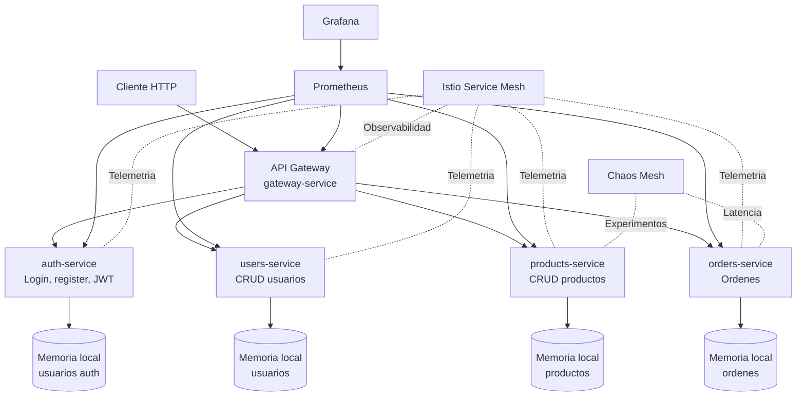
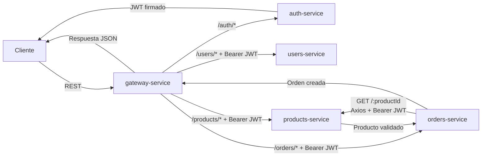
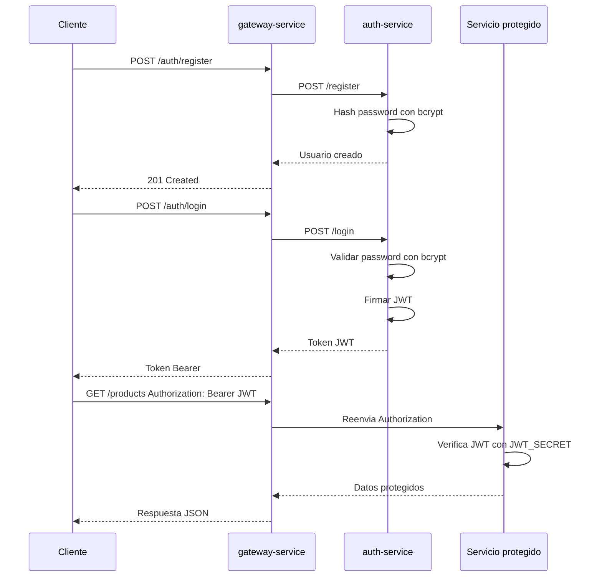
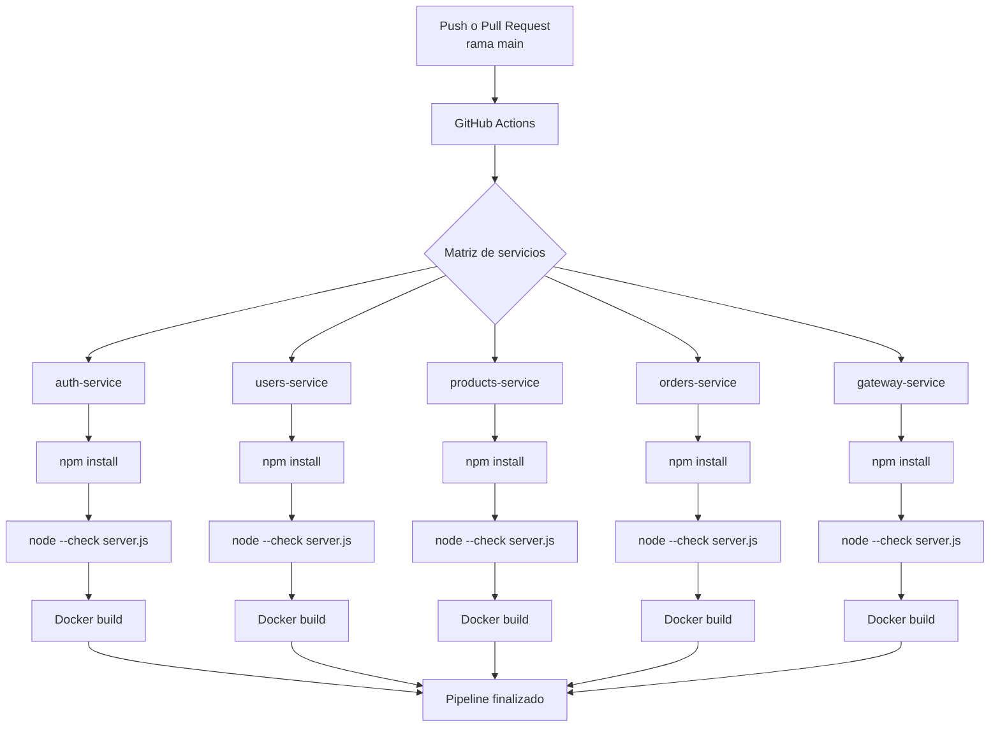
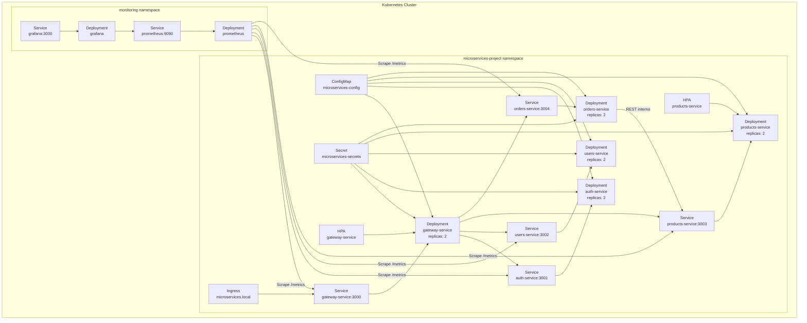

# Arquitectura del Proyecto

Este documento describe la arquitectura de `microservices-project` con diagramas Mermaid compatibles con GitHub.

## 1. Arquitectura General de Microservicios

## 2. Comunicacion Entre Servicios

## 3. Flujo de Autenticacion JWT

## 4. Pipeline CI/CD

## 5. Kubernetes Deployments y Services

